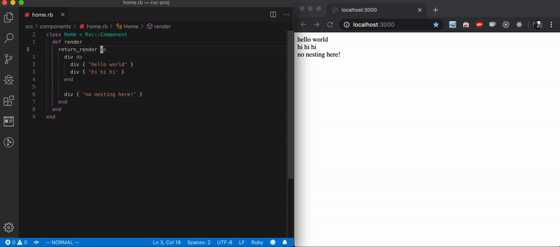

Among my favorite things about React development is the emphasis on hot-reloading.
Whenever I go back to building a Rails application, I find myself frustrated with 
having to swithc to the browser window to reload the page each time I save. Fortunately,
I can couple [LiveReload](https://github.com/livereload/livereload-js) with
[guard](https://github.com/guard/guard-livereload), to reload my browser on watched-file saves.

I want to be able to iterate on RVC quickly and test out functionality without
all of the overhead of a rails environment. So I'm going to set up a lightweight
environment using [rack](https://https://github.com/rack/rack) server. I'll get
started with this basic file structure:

```
rvc
  component.rb
  wrapper.rb
src
  components
    home.rb
app.rb
Gemfile
Guardfile
routes.yml
server.rb
```

I'll need the following gems to get this idea going:

```
  gem 'thin'
  gem 'rack'
  gem 'guard-livereload'
```

I'll require all of the necessary gems in `app.rb`, and I'll start my server with
`ruby server.rb`, the contents of `server.rb` will be:

```ruby
require './app'

app -> (env) do
  def call(env)
    load './rvc/component.rb'
    load './rvc/wrapper.rb'

    routes = YAML.load_file('./routes.yml')

    Dir['./src/components/**/*.rb'].each { |file| load file }

    path = env["REQUEST_PATH"]

    component = if path == '/'
                  routes['root']
                else
                  routes[path]
                end

    begin
      component_body = Object.const_get(component).new.render
    rescue 
      return [404, { 'Content-Type' => 'text/plain' }, ['Not found']]
    end

    [
      200,
      { 'Content-Type' => 'text/html' },
      [component_body]
    ]
  end
end

Rack::Handler::Thin.run app
```

I've set up key values in `routes.yml` for paths -> components. Each request will
find and call render on the component mapped to the path. If a mapping does
not exist in `routes.yml`, I'll return 404 with 'Not found'.

For now, `root` maps to the `Home` component:

```ruby
class Home < Rvc::Component
  def render
    return_render do
      div do
        div { 'hello world' }
        div { 'hi hi hi' }
      end

      div { 'no nesting here' }
    end
  end
end
```

The above component is basically a proof of concept of what I worked on in
[part one](/blog/a-dsl-for-writing-html-in-ruby) and renders HTML correctly. 

Now, to get LiveReload going, I have to inject the livereload script into every page on every request. The live reload is provided by `guard-livereload` at "http://localhost:35729/livereload.js", so the following needs to be injected into the page:

```html
<script src="http://localhost:35729/livereload.js"></script>
```

To do this, I'll make sure the script is included in every request by updating the body array returned by the rack app in `server.rb`:

```ruby
  body = [LiveReload.new.render]

  begin
    component_body = Object.const_get(component).new.render
  rescue 
    return [404, { 'Content-Type' => 'text/plain' }, body + ['Not found']]
  end

  [
    200,
    { 'Content-Type' => 'text/html' },
    body + [component_body]
  ]
```

and the `LiveReload` component will look like this:

```ruby
class LiveReload < Rvc::Component
  def render
    return_render do
      script src: 'http://localhost:35729/livereload.js'
    end
  end
end
```

This requires `Component`s to be able to handle attributes! I now have the
opportunity to include that HTML functionality. Here's where I left off with 
`Rvc::Component` and `Rvc::Wrapper` last time:

```ruby
module Rvc
  class Component
    private

    def return_render(&block)
      Wrapper.new(base: self, block: block).to_s
    end
  end
end
```

```ruby
module Rvc
  class Wrapper
    def initialize(method_name: nil, block:, base:)
      @method_name = method_name
      @block = block
      @render_elements = []
      @block_is_string = true
      @base = base
    end
  
    def to_s
      string = instance_eval(&@block)
  
      string = @render_elements.join('') if !@block_is_string
    
      if @method_name
        "<#{@method_name}>#{string}</#{@method_name}>"
      else
        string
      end
    end
    
    def method_missing(method_name, *args, &block)
      @block_is_string = false
    
      @render_elements << Wrapper.new(
        method_name: method_name,
        block: block,
        base: @base
      )
        .to_s
    end
  
    private
    
    attr_reader :base
  
    alias component base
  end
end
```

`Wrapper` now needs to be able to take in attributes. I'll start by adding that
to the constructor as a hash, then iterate over the pairs when constructing the string
`"<#{@method_name}>#{string}</#{@method_name}>"`. The other thing that this script tag
requires `Wrapper`s to handle is no body. Since I plan to invoke `#script` without
a block, `Wrapper`s need to skip evaulating the block when the block is `nil`. This
changes `Wrapper` to:

```ruby
module Rvc
  class Wrapper
    def initialize(method_name: nil, block: nil, attributes: {}, base:)
      @method_name = method_name
      @block = block
      @render_elements = []
      @block_is_string = true
      @attributes = attributes
      @base = base
    end
  
    def to_s
      string = instance_eval(&@block) unless @block.nil?
  
      string = @render_elements.join('') if !@block_is_string
    
      if @method_name
        "<#{@method_name}#{attributes_string}>#{string}</#{@method_name}>"
      else
        string
      end
    end
    
    def method_missing(method_name, *args, &block)
      @block_is_string = false
    
      @render_elements << Wrapper.new(
        method_name: method_name,
        block: block,
        attributes: args[0] || {},
        base: @base
      )
        .to_s
    end
  
    private
    
    attr_reader :base
  
    alias component base

    def attributes_string
      @attributes.each_with_object('').with_index do |((k, v), string), index|
        string << ' ' if index == 0
        string << k.to_s
        string << '='
        string << v

        string << ' ' if index < @attributes.keys.size - 1
      end
    end
  end
end
```

`Wrapper` now accepts a `block` argument that defualts to `nil` and a `attributes`
keyword argument that defaults to an empty hash. In the `#to_s` method,
the `string` local variable is `''` unless a block is passed in and the
`#attributes_string` takes the `@attributes` value and creates a string in the
following format: ` key_1=value_1 key_2=value_2`. New `Wrapper`s are
instantiated as part of `#method_missing` and assumes the `*args` argument
will have a hash or nil as the first element.

Testing confirms the script works as it should. Now I need to run two commands
to run the server: `ruby server.rb` and `bundle exec guard`.

I know `guard` has connected to the browser because I see:

```
23:24:28 - INFO - LiveReload is waiting for a browser to connect.
23:24:28 - INFO - Guard is now watching at '/Users/carlosquinones/practice/rvc'
[1] guard(main)> 23:24:32 - INFO - Browser connected.
```

The Guardfile configuration I have is watching the `src` and `rvc` directories
and the `routes.yml` file:

```
guard 'livereload' do
  watch(%r{src.+\.rb})
  watch(%r{rvc.+\.rb})
  watch('./routes.yml')
end
```

To ensure that changes are served in requests, I have to use `load` instead of `require`
to load in the component files and `Rvc` files. `load` reads in the file regardless 
of whether or not the program has already required it.

```ruby
# server.rb

def call(env)
  load './rvc/component.rb'
  load './rvc/wrapper.rb'

  routes = YAML.load_file('./routes.yml')

  Dir['./src/components/**/*.rb'].each { |file| load file }

  ...
end
```

Now I've got hot reloading going! 💪



In the next part, I'll use continue to build up on what I have so far to handle CSS.